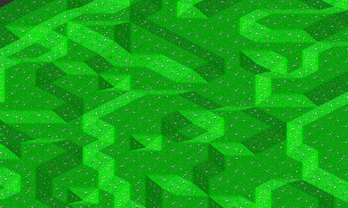
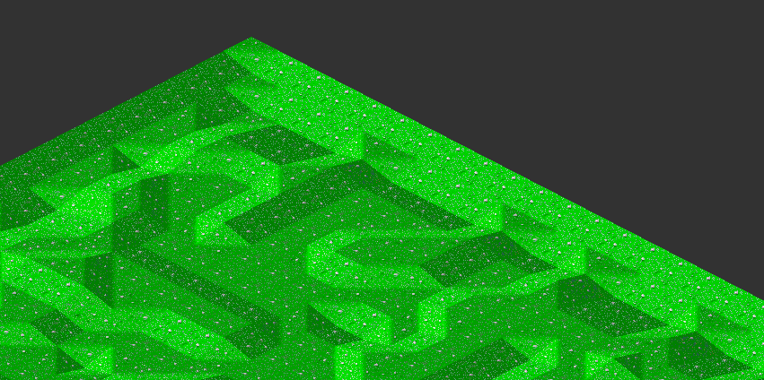

# Holiday Island Remastered

This is my attempt to build my version of Sunflower's Holiday Island from 1995. I used to play this game as a child and
I loved it! That being said, I know the "mechanics" weren't the most realistic, that's why I am also thinking about
adding my own personal flavour to my version of the game. I still want to keep the original design - thus I have
downloaded the game files (very easy nowadays) and started using the original tile set.

So far, I did quite a bit of research on isometric game design and I am very proud to have build a small map
generator, that renders the tiles based on a height map. There is no limit in terms of terrain levels, you can have 2 or
200 - it only depends on a correctly formatted height map. Below is small example I generated - if you check out the
repo, change the current height map I used (hardcoded for test purposes) and run the MapGenerator, you can play with it
a little. Make sure there are no vertical or horizontal jumps > 1 though!

## Todos - short term:

### cut out tiles

- annoying but necessary, the map tiles are in a tile collection, but it is way easier to use them when extracted into
  single files
- if you have a better solution, I am more than open!

### generate a random height map

- based on factors e.g. max terrain level, hilliness, water, no water, etc.
- based on a seed, I don't know much about procedural map generation, but if it makes sense, I want to implement it
- one thing to keep in mind is, that there must not be any jumps > 1 vertically or horizontally, since the original
  tiles do not support that
- I do not know yet if I want the maps to always start on level 0 on the edges, or maybe higher. It looks like a bowl if the map
  starts at 3 on the edges and instantly goes lower, so I got to figure that out

### implement scrolling

- implement the cursor
- in the original game, you had to right click to move the window, I want to make it scrollable by moving the cursor to
  the edge of the window like in every modern building game

### hover effect

- when hovering over the map, I want to see the outlines of the tile I am hovering over, this is going to get more
  important later

### terrain type

- render the correct type of terrain - sand, water, grass - based on the current terrain level
    - 0 = water
    - 1 & 2 = sand
    - above 2 = grass

### rivers

- there are river tiles, I don't know how or where to use them yet, so this is more of a "think about" todo

## Todos - long term

### add the UI elements

### add the building functionality

### add terrain modifications

### add the news window

### add more terrain types, snow, rock, maybe volcanoes that can cause special events etc

### ...
